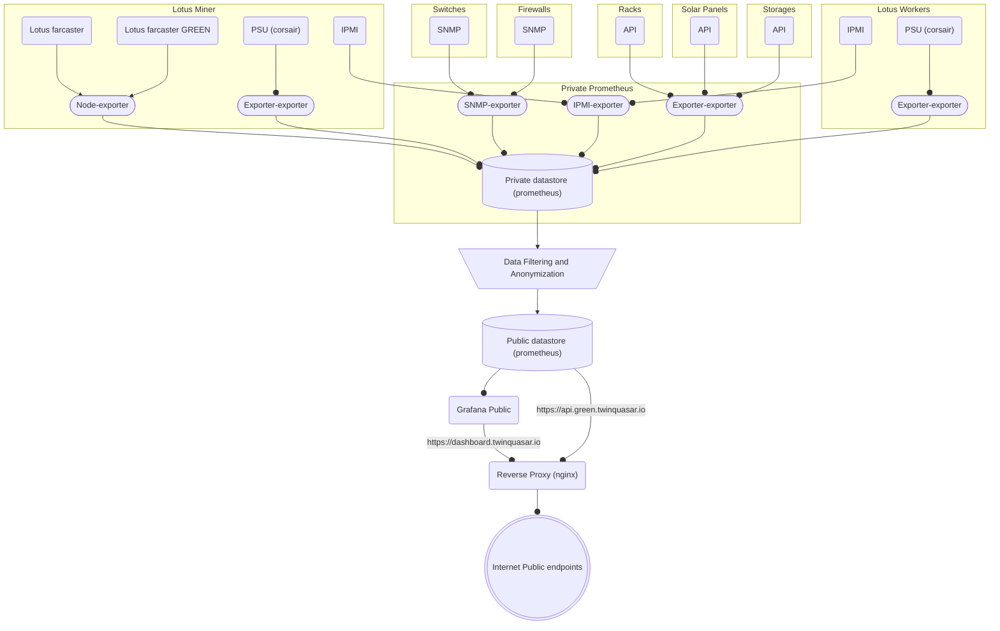
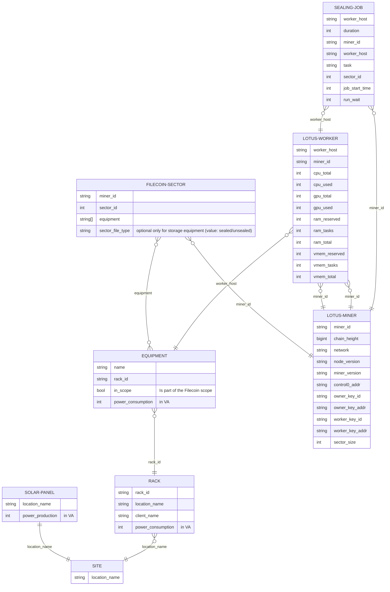

# Filecoin Green Power consumption tracking
## Summary
This project aims to enhance transparency regarding the long-term file storage efficiency on Filecoin by offering per Filecoin sector power consumption metrics.

This is accomplished by aggregating data from various sources:
- Solar Panels
- Grid
- Equipment:
  - Servers
  - Switches
  - Firewalls
  - JBODs
- Filecoin Lotus Implementation

The collected data is stored in a time series database ([prometheus](https://prometheus.io/)) with a data retention period ranging from 1.5 to 3.5 years.

## Dashboard example
To showcase the robustness of the data, we've swiftly created a Grafana dashboard to illustrate its capabilities.

https://dashboard.green.twinquasar.io (contact us to get access)
https://api.green.twinquasar.io  (contact us to get access)

The grafana dashboard can be downloaded form this repo [/grafana](/green/tree/master/grafana) 


## Security considerations
- Minimize the exposure of data to the essential amount.
- Ensure that publicly exposed platforms do not have access to private platforms.
- Employ active filtering reverse proxies and firewalls to protect all services.
- Eliminate the need for remote sudo access for enhanced security.
- Adhere strictly to the guidelines provided by Prometheus, Nginx, and Grafana.

## Recommended design
1. Data are exposed locally on servers, any prometheus scrapers can be use, we developped and adapt different scrapers to support Filecoin relative hardware from our stacks available in this repo.
2. Every minute the date is scapred by a private instance of prometheus; 
3. Data is filtered and anonimized by prometheus native configuration
4. Data is pushed and shared to a isolated public instance of prometheus.



## Data relationship 


## Individual power consumption scrappers
The project is built for flexibility, enabling any Prometheus scraper to fetch data. The Prometheus instance then standardizes and formats the metrics for consistent and uniform presentation.

### The list of scrapper we used for our implementation
- [ipmi on servers](exporters/ipmi/)
- [corsair power supply](exporters/corsair/)
- [jbod data60-redfish](exporters/data60-redfish/)
- node exporter
- snmp-exporter

### Metrics
Equipment Metrics Format:

```
green_equipment_power_consumption_va{equipment="EQUIPMENTNAME", rack_id, in_scope="(true|false)"}
```

#### Labels
- `equipment`: short hostname (no fqdn)
- `rack_id`: statically configured in prometheus configuration. Used to aggregate by rack
- `in_scope` should be set to True for any equipment directly utilized for Filecoin activities (servers, JBODs, etc.) and for shared equipment such as switches, PDUs, firewalls, etc. The "in_scope" parameter should be set to False for any equipment not associated with Filecoin activities.

## Rack and solar panel
- [rackconsumption](exporters/rackconsumption/)
- solar panels

###  Metrics
```	
green_rack_power_consumption_va{rack_id, location_name, client_name}
green_solar_panel_power_production_va{location_name}
```

#### Labels
- `rack_id`: must match equipments rack IDs
- `location_name`: used to matchs racks consumption and panel power production
- `client_name`: Client name if available

## Lotus
We utilize  [lotus-farcaster](https://github.com/s0nik42/lotus-farcaster) to export all useful Filecoin metrics, and we extend those metrics with  [lotus-farcaster green](https://github.com/s0nik42/lotus-farcaster), a lightweight add-on to lotus-farcaster.

### Metrics
#### Standard lotus-farcaster metrics 
```
lotus_chain_height{miner_id="f06257"} 
lotus_info{miner_id="f06257",network="mainnet",version="1.25.1"} 21
lotus_miner_info{control0="",control0_addr="",miner_id="",owner="",owner_addr="",version="",worker="",worker_addr=""} 1
lotus_miner_info_sector_size{miner_id="f06257"} 3.4359738368e+10
lotus_miner_worker_cpu{miner_id="f06257",worker_host="worker1"} 32
lotus_miner_worker_cpu_used{miner_id="f06257",worker_host="worker1"} 0
lotus_miner_worker_gpu{miner_id="f06257",worker_host="worker1"} 0
lotus_miner_worker_gpu_used{miner_id="f06257",worker_host="worker1"} 0
lotus_miner_worker_ram_reserved{miner_id="f06257",worker_host="worker1"} 6.6103382016e+10
lotus_miner_worker_ram_tasks{miner_id="f06257",worker_host="worker1"} 0
lotus_miner_worker_ram_total{miner_id="f06257",worker_host="worker1"} 2.70123102208e+11
lotus_miner_worker_vmem_reserved{miner_id="f06257",worker_host="worker1"} 6.6103382016e+10
lotus_miner_worker_vmem_tasks{miner_id="f06257",worker_host="worker1"} 0
lotus_miner_worker_vmem_total{miner_id="f06257",worker_host="worker1"} 2.70123102208e+11
```

#### Extended lotus-farcaster green metrics 
```
green_sector_resource(miner_id, sector_id, equipment="miner") 1
green_sector_resource(miner_id, sector_id, equipment="firewall") 1
green_sector_resource(miner_id, sector_id, equipment="switchs") 1
green_sector_resource(miner_id, sector_id, equipment="worker1") 1
green_sector_resource(miner_id, sector_id, equipment="jbod-01" sector_file_type="(sealed|unsealed)") 1
```

## Installation
### Private Prometheus instance configuration
1. Deploy the standard prometheus package (tested version: 2.27.0)
2. Deploy and configure the scrapers to collect data from various equipment, utilizing either standard scrapers or the modified scrapers available in this repository. The associated Prometheus configuration for each folder is provided.
3. Set up the data push to the public instance.
```yaml
remote_write:
  - url: "http://PUBLIC_INSTANCE_IP:PORT/api/v1/write"
    name: Green
    write_relabel_configs:
      # Filter to only the metrics we want to publicly expose
      - action: keep
        source_labels:
          - "__name__"
        regex: "[a-z]+_green_(equipment_power_consumption_va|rack_power_consumption_va|solar_panel_power_production_va|sector_resource)|lotus_(info|miner_info|miner_info_sector_size|miner_worker_job|miner_worker_cpu|miner_worker_cpu_used|miner_worker_gpu|miner_worker_gpu_used|miner_worker_ram_total|miner_worker_ram_tasks|miner_worker_ram_reserved|miner_worker_vmem_total|miner_worker_vmem_tasks|miner_worker_vmem_reserved|chain_height)"
      # anonymized instance label
      - action: replace
        source_labels:
          - "instance"
        regex: ".*"
        replacement: "green.twinquasar.io"
        target_label: "instance"
      # remove any job and environment label
      - action: labeldrop
        regex: "job|environment|job_id"
      # rename xxx_green_xxx metrics
      - action: replace
        source_labels:
          - "__name__"
        target_label: __name__
        separator: ;
        regex: "[a-z]+_(green_.*)"
        replacement: $1
```

### Grafana
Install the standard way
Tested version : 10.2.0

### Lotus-farcaster
Follow the instruction here https://github.com/s0nik42/lotus-farcaster

### Lotus-farcaster Green
Once Lotus-farcaster is installed, install the green add-on [here](https://github.com/s0nik42/lotus-farcaster/tree/main/lotus-exporter-farcaster-green)

### NGINX Configuration
#### Prometheus reverse proxy configuration
Apply the following configuration to protect the promql routes and restrict access to admin routes :

```nginx
server {
    location /api {
        return 403;
    }
    location / {
        include snippets/prometheus.conf;
    }
    location /api/v1/query {
        include snippets/prometheus.conf;
    }
    location /api/v1/query_range {
        include snippets/prometheus.conf;
    }
    location /api/v1/format_query {
        include snippets/prometheus.conf;
    }
    location /api/v1/series {
        include snippets/prometheus.conf;
    }
    location /api/v1/labels {
        include snippets/prometheus.conf;
    }
    location /api/v1/label {
        include snippets/prometheus.conf;
    }
    location /api/v1/query_exemplars {
        include snippets/prometheus.conf;
    }
}
```

##### snippets/prometheus.conf file content 
```nginx
        proxy_pass http://XXX.XXX.XXX.XXX:9090;
        proxy_set_header Host $host;
        proxy_set_header X-Real-IP $remote_addr;
        proxy_set_header X-Forwarded-For $proxy_add_x_forwarded_for;
        # Websocket
        proxy_http_version 1.1;
        proxy_set_header Upgrade $http_upgrade;
        proxy_set_header Connection "Upgrade";
```

#### Grafana reverse proxy configuration
Add the following configuration to the grafana vhost :
```nginx
server {
    location / {
        proxy_pass http://XXX.XXX.XXX.XXX:3000/;
        proxy_set_header Host $host;
        proxy_set_header X-Real-IP $remote_addr;
        proxy_set_header X-Forwarded-For $proxy_add_x_forwarded_for;
        # Websocket
        proxy_http_version 1.1;
        proxy_set_header Upgrade $http_upgrade;
        proxy_set_header Connection "Upgrade";
    }
}
```

## Sponsor
[](https://fil.org/) via the [dev grant program](https://github.com/filecoin-project/devgrants/issues/1042)
